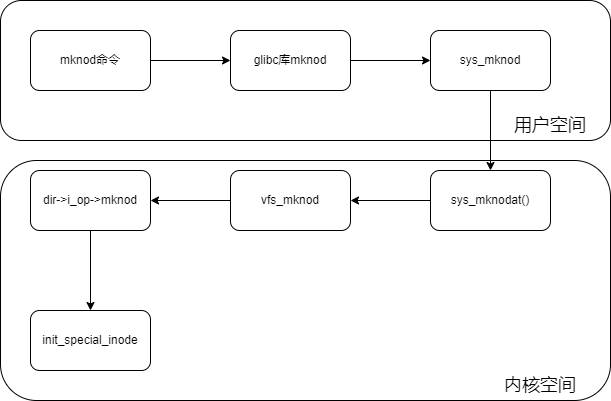
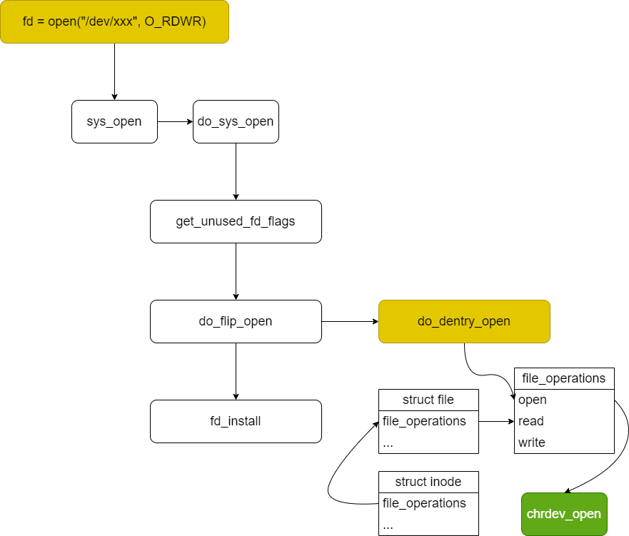
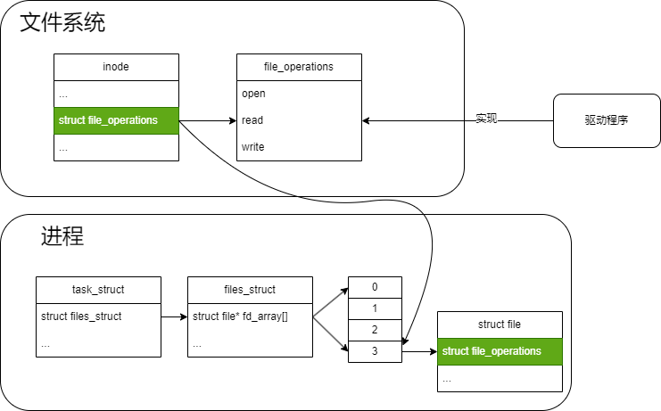

# 文件系统

## inode

VFS inode 包含文件访问权限、属主、组、大小、生成时间、访问时间、最后修改时间等信息。 它是Linux 管理文件系统的最基本单位，也是文件系统连接任何子目录、文件的桥梁。 内核使用inode结构体在内核内部表示一个文件。因此，它与表示一个已经打开的文件描述符的结构体(即file 文件结构)是不同的， 我们可以使用多个file文件结构表示同一个文件的多个文件描述符，但此时， 所有的这些file文件结构全部都必须只能指向一个inode结构体。 inode结构体包含了一大堆文件相关的信息，但是就针对驱动代码来说，我们只要关心其中的两个域即可：

+ dev_t i_rdev： 表示设备文件的结点，这个域实际上包含了设备号。

+ struct cdev *i_cdev： struct cdev是内核的一个内部结构，它是用来表示字符设备的，当inode结点指向一个字符设备文件时，此域为一个指向inode结构的指针。

每个文件对应一个inode，创建文件时会创建一个inode  
特殊的设备文件使用mknod命令进行创建:  
`mknod`命令  
用法：mknod 设备名 设备类型 主设备号 次设备号  

+ b 创建(有缓冲的)区块特殊文件  
+ c, u 创建(没有缓冲的)字符特殊文件  
+ p 创建先进先出(FIFO)特殊文件  

如：`mkmod /dev/test c 2 0`  
作用:

+ 创建inode节点  
+ 构建一个新的设备文件
+ 通过主次设备号，在内核中的cdev_map中找到对应的cdev
+ 然后将cdev->file_operations绑定到该设备文件对应的`inode`中

后续应用程序对文件的open操作会读取`inode`中保存的`file_operations`，进行相对应的操作。
  

```C
void init_special_inode(struct inode *inode, umode_t mode, dev_t rdev)
{
    inode->i_mode = mode;
    if (S_ISCHR(mode)) {
        inode->i_fop = &def_chr_fops;
        inode->i_rdev = rdev;
    }
    ...
}
```

最终`init_special_inode`将命令输入的设备号保存到i_rdev。
并将`def_chr_fops`绑定到i_fop上，`def_chr_fops`是字符设备通用文件操作方法，这里还没有将我们自己实现的`file_operations`绑定到inode中。

```C
const struct file_operations def_chr_fops = {
    .open = chrdev_open,
    .llseek = noop_llseek,
};
```

`def_chr_fops`只包含定义了两个方法，其中chrdev_open函数中会重新绑定我们自己实现的`file_operations`到inode上。
`chrdev_open`会在用户程序调用open的时候被间接调用到：


+ get_unused_fd_flags
  + 为本次操作分配一个未使用过的文件描述符

+ do_file_open
  + 生成一个空白struct file结构体
  + 从文件系统中查找到文件对应的inode

+ do_dentry_open  
open过程中，会将inode的`file_operations`赋值给task_strut中file的`file_operations`


```C
static int do_dentry_open(struct file *f,
                struct inode *inode,
                int (*open)(struct inode *, struct file *))
{
    ...
    /*把inode的i_fop赋值给struct file的f_op*/
    f->f_op = fops_get(inode->i_fop);
    ...
    if (!open)
        open = f->f_op->open;
    if (open) {
        error = open(inode, f);
        if (error)
            goto cleanup_all;
}
...
}
```

+ def_chr_fops->chrdev_open

```C
static int chrdev_open(struct inode *inode, struct file *filp)
{
    const struct file_operations *fops;
    struct cdev *p;
    struct cdev *new = NULL;
    ...
    struct kobject *kobj;
    int idx;
    /*从内核哈希表cdev_map中，根据设备号查找自己注册的sturct cdev，获取cdev中的file_operation接口*/
    kobj = kobj_lookup(cdev_map, inode>i_rdev,&idx);
    new = container_of(kobj, struct cdev, kobj);
    ...
    inode->i_cdev = p = new;
    ...
    fops = fops_get(p->ops);
    ...
    /*把cdev中的file_operation接口赋值给struct file的f_op*/
    replace_fops(filp, fops);

    /*调用自己实现的file_operation接口中的open函数*/
    if (filp->f_op->open) {
        ret = filp->f_op->open(inode, filp);
        if (ret)
            goto out_cdev_put;
    }
...
}
```

## file

内核中用file结构体来表示每个打开的文件，每打开一个文件，内核会创建一个结构体，并将对该文件上的操作函数传递给 该结构体的成员变量f_op，当文件所有实例被关闭后，内核会释放这个结构体。

```C
struct file {
const struct file_operations *f_op;
/* needed for tty driver, and maybe others */
void *private_data;
};
```

+ f_op：存放与文件操作相关的一系列函数指针，如open、read、wirte等函数。 

+ private_data：该指针变量只会用于设备驱动程序中，内核并不会对该成员进行操作。因此，在驱动程序中，通常用于指向描述设备的结构体。

## file_operation

file_operation就是把系统调用和驱动程序关联起来的关键数据结构。

```C
struct file_operations {
   struct module *owner;
   loff_t (*llseek) (struct file *, loff_t, int);
   ssize_t (*read) (struct file *, char __user *, size_t, loff_t *);
   ssize_t (*write) (struct file *, const char __user *, size_t, loff_t *);
   long (*unlocked_ioctl) (struct file *, unsigned int, unsigned long);
   int (*open) (struct inode *, struct file *)
   int (*release) (struct inode *, struct file *);
};
```
