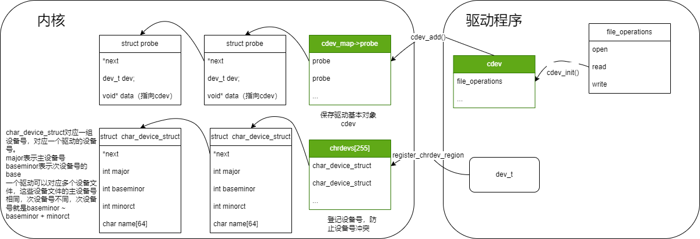

# 字符设备

+ 设备号
设备号分主设备号、次设备号，linux内核希望一个驱动程序对应一个主设备号、多个次设备号。
一个设备文件通常对应一个主设备号、一个次设备号，所以设备驱动和设备文件是一对多的关系。

open函数在文件系统中，通过文件名对应的`inode`，找到指定文件的操作接口`file_operations`。
然后将`file_operations`记录在进程的`task_struct`对应的数组中，open函数返回的fd实际上就是数组的下标。

问题：

+ 什么时候`inode`与`file_operations`绑定的?
  使用mknod创建inode的绑定的，通过mknod输入的设备号，查找到对应的cdev，从而得到`file_operations`

## 字符设备注册

## gloalmem

使用insmod安装好驱动后，可以通过`cat /proc/devices`查看，发现多出了主设备号为230的字符设备驱动  
  
接下来通过`mknod /dev/globalmem c 230 0`创建设备节点。  
使用mknod后，将在dev目录下生成一个文件，我们可以对这个文件进行读写操作，等同于对字符设备进行读写操作。  

## led

+ [ ] 写一个led的测试程序

[参考文档](https://doc.embedfire.com/linux/imx6/base/zh/latest/linux_driver/led_character_device.html)  
