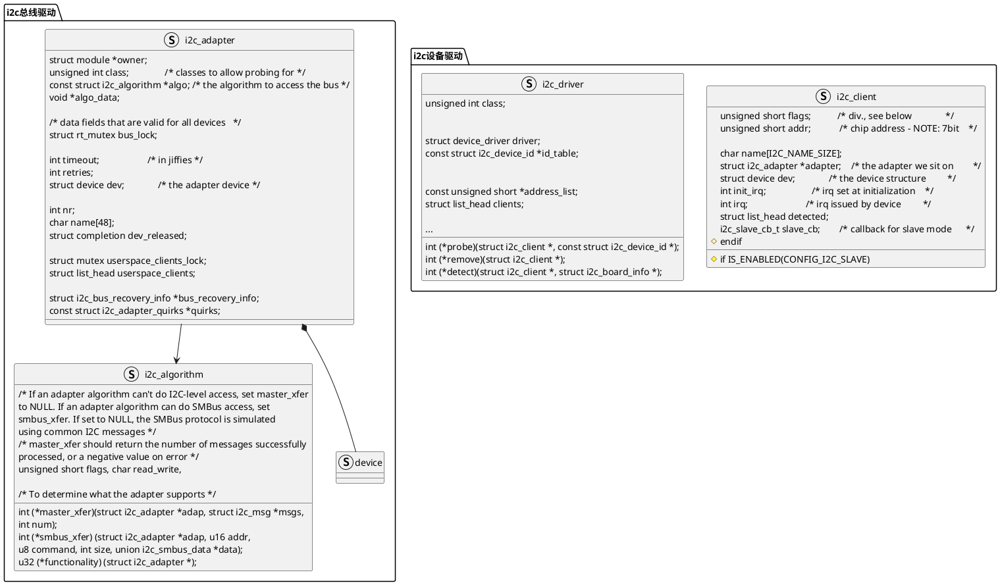

# I2C

[TOC]

```plantuml
@startuml I2C

package i2c总线驱动
{

struct i2c_adapter 
{
    struct module *owner;
    unsigned int class;               /* classes to allow probing for */
    const struct i2c_algorithm *algo; /* the algorithm to access the bus */
    void *algo_data;

    /* data fields that are valid for all devices   */
    struct rt_mutex bus_lock;

    int timeout;                    /* in jiffies */
    int retries;
    struct device dev;              /* the adapter device */

    int nr;
    char name[48];
    struct completion dev_released;

    struct mutex userspace_clients_lock;
    struct list_head userspace_clients;

    struct i2c_bus_recovery_info *bus_recovery_info;
    const struct i2c_adapter_quirks *quirks;
}

struct i2c_algorithm {
    /* If an adapter algorithm can't do I2C-level access, set master_xfer
       to NULL. If an adapter algorithm can do SMBus access, set
       smbus_xfer. If set to NULL, the SMBus protocol is simulated
       using common I2C messages */
    /* master_xfer should return the number of messages successfully
       processed, or a negative value on error */
    int (*master_xfer)(struct i2c_adapter *adap, struct i2c_msg *msgs,
                       int num);
    int (*smbus_xfer) (struct i2c_adapter *adap, u16 addr,
                       unsigned short flags, char read_write,
                       u8 command, int size, union i2c_smbus_data *data);

    /* To determine what the adapter supports */
    u32 (*functionality) (struct i2c_adapter *);
}

struct device
{

}


i2c_adapter *-- device
i2c_adapter --> i2c_algorithm

}

package i2c设备驱动
{
    struct i2c_client {
            unsigned short flags;           /* div., see below              */
            unsigned short addr;            /* chip address - NOTE: 7bit    */

            char name[I2C_NAME_SIZE];
            struct i2c_adapter *adapter;    /* the adapter we sit on        */
            struct device dev;              /* the device structure         */
            int init_irq;                   /* irq set at initialization    */
            int irq;                        /* irq issued by device         */
            struct list_head detected;
            #if IS_ENABLED(CONFIG_I2C_SLAVE)
                    i2c_slave_cb_t slave_cb;        /* callback for slave mode      */
            #endif
    }

    struct i2c_driver {
            unsigned int class;

            int (*probe)(struct i2c_client *, const struct i2c_device_id *);
            int (*remove)(struct i2c_client *);

            struct device_driver driver;
            const struct i2c_device_id *id_table;

            int (*detect)(struct i2c_client *, struct i2c_board_info *);

            const unsigned short *address_list;
            struct list_head clients;

            ...
    }
}


@enduml
```
