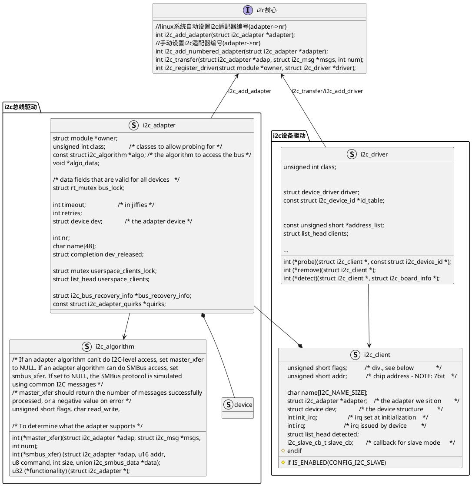

# I2C总线

[TOC]



I2C驱动分为总线驱动和设备驱动：
+ 1 总线驱动：🈯️I2C控制器驱动，I2C控制器基于platform总线，i2c总线驱动在probe函数中会申请注册一个`i2c_adapter`到系统中。I2C设备驱动会使用`i2c_adapter`作为句柄，与I2C核心交互。
+ 2 设备驱动：🈯️使用I2C进行通讯的设备驱动，例如使用I2C通信的mpu6050、oled模块等。不同的设备会有不同的操作方式，例如mpu6050需要设置采样率、oled需要设置分辨率等，这些实在设备驱动中控制的，而这些操作命令都是通过I2C总线发送给设备的。
  
当我们在I2C总线挂载一个设备时，只需要在设备树中的I2C控制器节点下添加我们的设备节点：
```dts
&i2c1 {
	clock_frequency = <100000>;
	pinctrl-names = "default";
	pinctrl-0 = <&pinctrl_i2c1>;
	status = "okay";
       
	i2c_mpu6050@68 {
		compatible = "fire,i2c_mpu6050";
		reg = <0x68>;
		status = "okay";
	};
};
```
系统帮我们自动生成对应的`i2c_client`，这个`i2c_client`会绑定这个I2C控制器对应的`i2c_adapter`。
我们写的设备驱动，就会利用`i2c_client`中的`i2c_adapter`进行I2C通讯。
I2C总线驱动通常由芯片厂商提供，我们只需要实现我们新添加的I2C设备驱动即可。