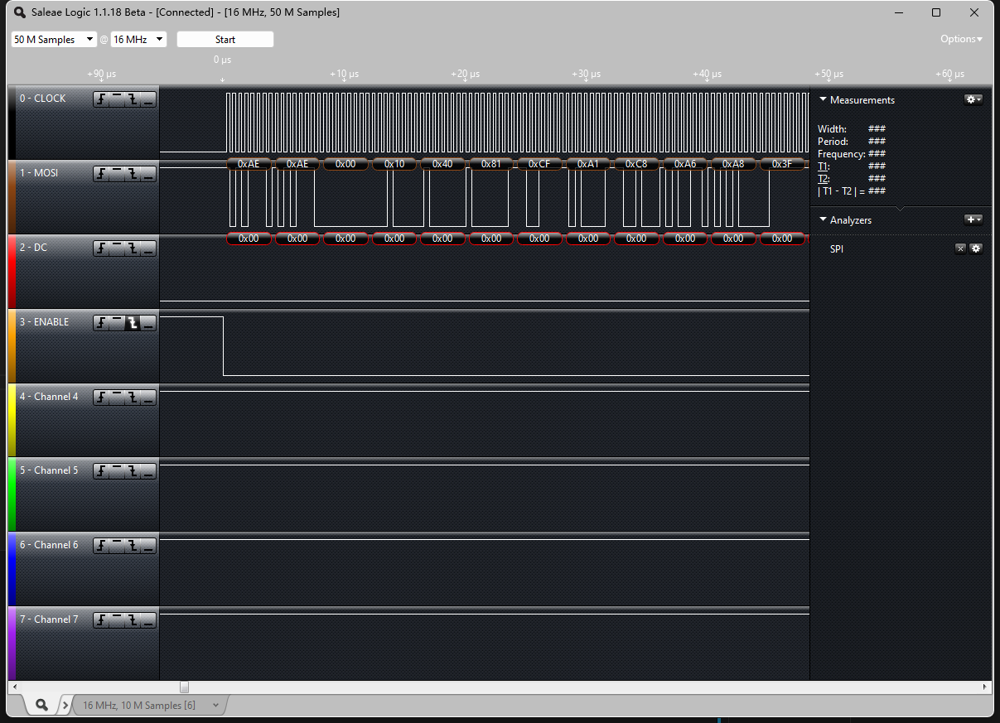

# SPI总线

[TOC]

```plantuml
interface spi核心层
{
    int spi_register_master();
    int spi_register_controller(struct spi_controller *ctlr);
    int spi_register_driver(struct spi_driver *sdrv)
    static inline void spi_unregister_driver(struct spi_driver *sdrv)
    int spi_setup(struct spi_device *spi)
    int spi_async(struct spi_device *spi, struct spi_message *message)
    int spi_sync(struct spi_device *spi, struct spi_message *message)
}

package spi总线驱动
{

struct spi_controller {
    struct device   dev;
    ...
    struct list_head list;
    s16    bus_num;
    u16    num_chipselect;
    ...
    struct spi_message              *cur_msg;
    ...
    int                     (*setup)(struct spi_device *spi);
int                     (*transfer)(struct spi_device *spi, struct spi_message *mesg);
    void            (*cleanup)(struct spi_device *spi);
    struct kthread_worker           kworker;
    struct task_struct              *kworker_task;
    struct kthread_work             pump_messages;
    struct list_head                queue;
    struct spi_message              *cur_msg;

    ...
    int (*transfer_one)(struct spi_controller *ctlr, struct spi_device *spi,struct spi_transfer *transfer);
    int (*prepare_transfer_hardware)(struct spi_controller *ctlr);
    int (*transfer_one_message)(struct spi_controller *ctlr,struct spi_message *mesg);
    void (*set_cs)(struct spi_device *spi, bool enable);
    ...
    int                     *cs_gpios;
}

}

spi_controller -up-> spi核心层 : spi_register_master

package spi设备驱动
{

struct spi_driver {
    const struct spi_device_id *id_table;
    int                     (*probe)(struct spi_device *spi);
    int                     (*remove)(struct spi_device *spi);
    void                    (*shutdown)(struct spi_device *spi);
    struct device_driver    driver;
}

struct spi_device {
	struct device		dev;
	struct spi_controller	*controller;
	struct spi_controller	*master;	/* compatibility layer */
	u32			max_speed_hz;
	u8			chip_select;
	u8			bits_per_word;
	u16			mode;
	int			irq;
	void			*controller_state;
	void			*controller_data;
	char			modalias[SPI_NAME_SIZE];
	int			cs_gpio;	/* chip select gpio */

	/* the statistics */
	struct spi_statistics	statistics;
}

spi_driver --> spi_device

}

spi_controller -left-* spi_device 
spi_driver -up-> spi核心层 : spi_register_driver/spi_sync
```

## 波形



